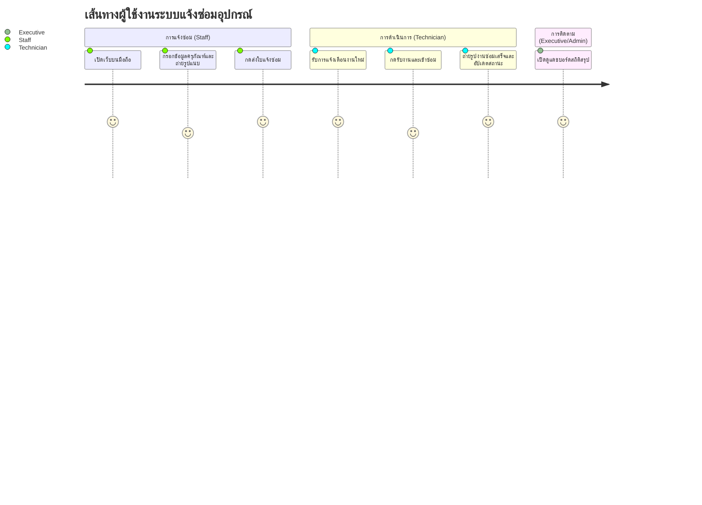
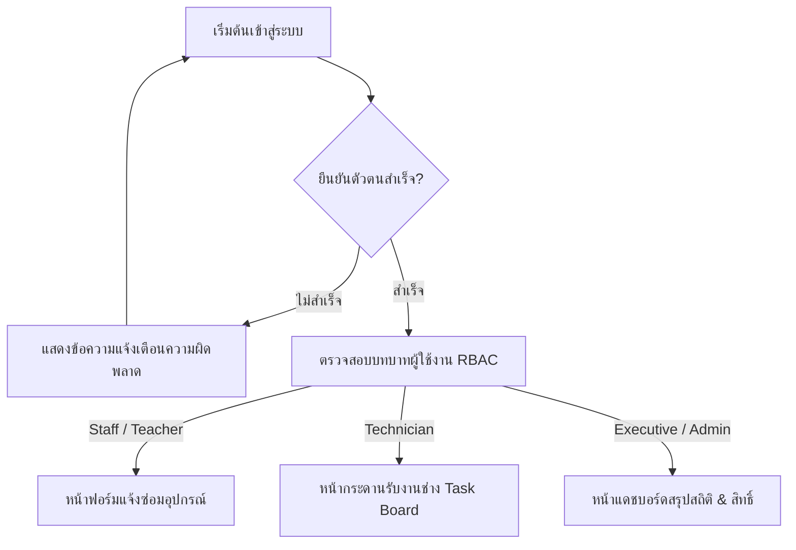
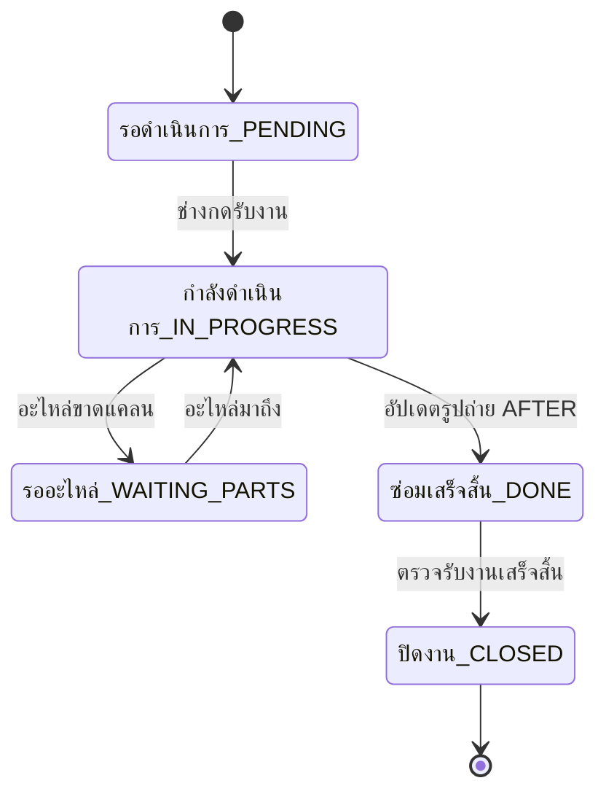
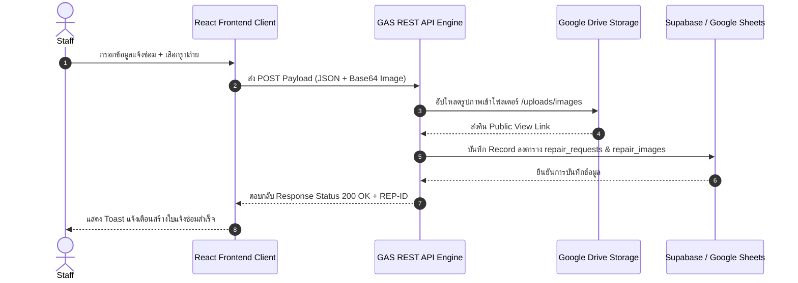
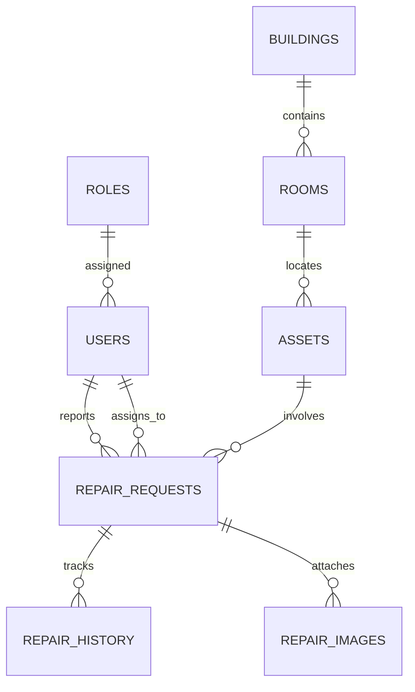

# 📘 เอกสารออกแบบสถาปัตยกรรมระบบเว็บแอปพลิเคชันแจ้งอุปกรณ์ชำรุด
**(Enterprise Solution Architecture Specification)**

---

## 📑 สารบัญ (Table of Contents)

1. [การวิเคราะห์ระบบ (System Analysis)](#1-การวิเคราะห์ระบบ-system-analysis)
2. [ข้อกำหนดฟังก์ชันการทำงาน (Functional Requirements)](#2-ข้อกำหนดฟังก์ชันการทำงาน-functional-requirements)
3. [ข้อกำหนดด้านคุณภาพและประสิทธิภาพ (Non-Functional Requirements)](#3-ข้อกำหนดด้านคุณภาพและประสิทธิภาพ-non-functional-requirements)
4. [กลุ่มผู้ใช้งานเป้าหมาย (User Personas)](#4-กลุ่มผู้ใช้งานเป้าหมาย-user-personas)
5. [ผู้มีส่วนได้ส่วนเสีย (Stakeholders)](#5-ผู้มีส่วนได้ส่วนเสีย-stakeholders)
6. [เส้นทางของผู้ใช้ (User Journey)](#6-เส้นทางของผู้ใช้-user-journey)
7. [ผังลำดับขั้นตอนการทำงาน (User Flow)](#7-ผังลำดับขั้นตอนการทำงาน-user-flow)
8. [สถาปัตยกรรมสารสนเทศ (Information Architecture)](#8-สถาปัตยกรรมสารสนเทศ-information-architecture)
9. [แผนผังเว็บไซต์ (Site Map)](#9-แผนผังเว็บไซต์-site-map)
10. [ไดอะแกรมกรณีการใช้งาน (Use Case Diagram)](#10-ไดอะแกรมกรณีการใช้งาน-use-case-diagram)
11. [ไดอะแกรมกิจกรรม (Activity Diagram)](#11-ไดอะแกรมกิจกรรม-activity-diagram)
12. [ไดอะแกรมลำดับขั้นตอน (Sequence Diagram)](#12-ไดอะแกรมลำดับขั้นตอน-sequence-diagram)
13. [ไดอะแกรมความสัมพันธ์ข้อมูล (ER Diagram)](#13-ไดอะแกรมความสัมพันธ์ข้อมูล-er-diagram)
14. [โครงสร้างฐานข้อมูล (Database Schema)](#14-โครงสร้างฐานข้อมูล-database-schema)
15. [โครงสร้างตารางข้อมูล (Table Structure)](#15-โครงสร้างตารางข้อมูล-table-structure)
16. [การออกแบบ API (API Design)](#16-การออกแบบ-api-api-design)
17. [เอกสารอธิบาย API (API Documentation)](#17-เอกสารอธิบาย-api-api-documentation)
18. [โครงสร้างโฟลเดอร์โปรเจกต์ (Folder Structure)](#18-โครงสร้างโฟลเดอร์โปรเจกต์-folder-structure)
19. [โครงร่างหน้าจอ (Wireframe Specification)](#19-โครงร่างหน้าจอ-wireframe-specification)
20. [การออกแบบหน้าจอความละเอียดสูง (High Fidelity UI Design)](#20-การออกแบบหน้าจอความละเอียดสูง-high-fidelity-ui-design)
21. [ระบบการออกแบบ (Design System Specification)](#21-ระบบการออกแบบ-design-system-specification)
22. [ชุดสีของระบบ (Color Palette)](#22-ชุดสีของระบบ-color-palette)
23. [ระบบแบบอักษร (Typography)](#23-ระบบแบบอักษร-typography)
24. [คลังคอมโพเนนต์ (Component Library)](#24-คลังคอมโพเนนต์-component-library)
25. [การออกแบบแดชบอร์ด (Dashboard Design)](#25-การออกแบบแดชบอร์ด-dashboard-design)
26. [การออกแบบหน้าจัดการข้อมูล (CRUD Pages Design)](#26-การออกแบบหน้าจัดการข้อมูล-crud-pages-design)
27. [การออกแบบหน้ารายงาน (Report Pages Design)](#27-การออกแบบหน้ารายงาน-report-pages-design)
28. [ขั้นตอนการยืนยันตัวตน (Authentication Flow)](#28-ขั้นตอนการยืนยันตัวตน-authentication-flow)
29. [การกำหนดสิทธิ์และการเข้าถึง (Authorization & RBAC/RLS Design)](#29-การกำหนดสิทธิ์และการเข้าถึง-authorization--rbacrls-design)
30. [สถาปัตยกรรมจัดเก็บไฟล์ Google Drive (Google Drive Integration Architecture)](#30-สถาปัตยกรรมจัดเก็บไฟล์-google-drive)
31. [สถาปัตยกรรม Google Apps Script (Google Apps Script Engine & Protection Architecture)](#31-สถาปัตยกรรม-google-apps-script)
32. [สถาปัตยกรรมฐานข้อมูล Supabase (Supabase PostgreSQL Architecture)](#32-สถาปัตยกรรมฐานข้อมูล-supabase)
33. [สถาปัตยกรรมสำหรับการนำขึ้นใช้งาน (Deployment Architecture)](#33-สถาปัตยกรรมสำหรับการนำขึ้นใช้งาน-deployment-architecture)
34. [การออกแบบความปลอดภัยของระบบ (Security Design)](#34-การออกแบบความปลอดภัยของระบบ-security-design)
35. [กลยุทธ์การสำรองข้อมูล (Backup Strategy)](#35-กลยุทธ์การสำรองข้อมูล-backup-strategy)
36. [การปรับแต่งประสิทธิภาพระบบ (Performance Optimization)](#36-การปรับแต่งประสิทธิภาพระบบ-performance-optimization)
37. [ข้อกำหนดการรองรับหลายขนาดหน้าจอ (Responsive Design Guidelines)](#37-ข้อกำหนดการรองรับหลายขนาดหน้าจอ-responsive-design-guidelines)
38. [แผนการทดสอบระบบ (Testing Plan)](#38-แผนการทดสอบระบบ-testing-plan)
39. [การรองรับการขยายตัวในอนาคต (Future Scalability)](#39-การรองรับการขยายตัวในอนาคต-future-scalability)
40. [ข้อแนะนำตามมาตรฐานที่ดีที่สุด (Best Practice Recommendations)](#40-ข้อแนะนำตามมาตรฐานที่ดีที่สุด-best-practice-recommendations)

---

## 1. การวิเคราะห์ระบบ (System Analysis)
- **ปัญหาหลัก (Pain Points):** กระบวนการแจ้งซ่อมอุปกรณ์ในสถาบันการศึกษามักเป็นแบบกระดาษหรือโทรแจ้ง ส่งผลให้ติดตามสถานะยาก ข้อมูลตกหล่น ขาดหลักฐานภาพถ่าย และผู้บริหารขาดแดชบอร์ดสรุปสถิติเพื่อวางแผนงบประมาณซ่อมบำรุง
- **โซลูชัน (Proposed Solution):** Web Application แบบ Responsive (Mobile-First) เชื่อมต่อ Google Apps Script (GAS) สำหรับ API middleware, Google Drive สำหรับระบบไฟล์สื่อภาพถ่าย และ Supabase / Google Sheets สำหรับจัดเก็บโครงสร้างข้อมูลเชิงสัมพันธ์แบบเรียลไทม์

---

## 2. ข้อกำหนดฟังก์ชันการทำงาน (Functional Requirements)
- **FR-01 (Authentication & RBAC):** ระบบยืนยันตัวตนและจัดการสิทธิ์ 6 ระดับ (Super Admin, Admin, Executive, Staff, Technician, Viewer)
- **FR-02 (Repair Request Management):** ฟอร์มแจ้งซ่อมรองรับการระบุครุภัณฑ์, อาคาร, ห้อง, ความเร่งด่วน และแนบรูปภาพก่อนซ่อม (BEFORE)
- **FR-03 (Technician Task Board):** กระดานรับงานช่าง ซ่อมบำรุง, เปลี่ยนสถานะ (PENDING, ASSIGNED, IN_PROGRESS, WAITING_PARTS, DONE), บันทึกวิธีซ่อม และแนบรูปหลังซ่อม (AFTER)
- **FR-04 (Executive Dashboard & Analytics):** แดชบอร์ดแสดง KPI Summary Cards, กราฟสถิติตามหมวดหมู่/อาคาร และตารางข้อมูลพร้อม Filter
- **FR-05 (Asset & Storage Management):** ระบบค้นหาครุภัณฑ์ และจัดการไฟล์สื่อภาพถ่ายบน Google Drive ผ่าน GAS API

---

## 3. ข้อกำหนดด้านคุณภาพและประสิทธิภาพ (Non-Functional Requirements)
- **NFR-01 (Performance):** หน้าเว็บเปิดได้ภายใน 1.5 วินาที (Page Load < 1.5s), API Response < 800ms
- **NFR-02 (Availability & Reliability):** รองรับระบบการทำงานต่อเนื่อง 99.9% มี Retry Mechanism (Exponential Backoff) ป้องกันความหน่วง API
- **NFR-03 (Security & Compliance):** ป้องกัน F12 Code Inspection, SQL Injection, XSS, CSRF และบังคับใช้นโยบาย RLS (Row Level Security)

---

## 4. กลุ่มผู้ใช้งานเป้าหมาย (User Personas)
1. **ผู้บริหาร / ผู้อำนวยการ (Executive):** ต้องการดูสถิติภาพรวม แดชบอร์ดสรุปงบประมาณและระยะเวลาซ่อมเฉลี่ย
2. **ครู / เจ้าหน้าที่ (Staff):** ต้องการแจ้งซ่อมอุปกรณ์เสียในห้องเรียนได้ง่ายผ่านมือถือ ถ่ายรูปแนบได้ทันที
3. **ช่างซ่อมบำรุง (Technician):** ต้องการเห็นรายการงานที่ได้รับมอบหมาย รับงานง่าย อัปเดตสถานะและรูปหลังซ่อมเสร็จผ่านสมาร์ทโฟน
4. **ผู้ดูแลระบบ (Admin / Super Admin):** ต้องการจัดการผู้ใช้งาน, ครุภัณฑ์, สิทธิ์ และดู Audit Logs

---

## 5. ผู้มีส่วนได้ส่วนเสีย (Stakeholders)
- ฝ่ายบริหารวิทยาลัย, ฝ่ายพัสดุและอาคารสถานที่, ฝ่ายเทคโนโลยีสารสนเทศ, ครูอาจารย์และบุคลากรทางการศึกษา

---

## 6. เส้นทางของผู้ใช้ (User Journey)


---

## 7. ผังลำดับขั้นตอนการทำงาน (User Flow)


---

## 8. สถาปัตยกรรมสารสนเทศ (Information Architecture)
```
[ App Root ]
 ├── 1. Authentication (Login / OAuth)
 ├── 2. Dashboard (KPI Cards, Analytics Chart, Recent Requests Table)
 ├── 3. Repair Management (New Request Form, Task Board, Request Details View)
 ├── 4. Asset & Room Management (Asset List, Categories, Buildings, Rooms)
 └── 5. Administration (User Roles, Audit Logs, Drive Storage Explorer)
```

---

## 9. แผนผังเว็บไซต์ (Site Map)
- `/` -> หน้าเข้าสู่ระบบ (Login Page)
- `/dashboard` -> หน้าหลักแดชบอร์ดและสถิติภาพรวม
- `/repair/new` -> หน้าแบบฟอร์มแจ้งซ่อมอุปกรณ์
- `/tasks` -> หน้ากระดานรับงานของช่างซ่อมบำรุง
- `/assets` -> หน้าจัดการข้อมูลครุภัณฑ์และอาคารสถานที่
- `/audit` -> หน้าบันทึกความปลอดภัย Audit Logs ( Admin Only )

---

## 10. ไดอะแกรมกรณีการใช้งาน (Use Case Diagram)
```mermaid
usecaseDiagram
    actor Staff
    actor Technician
    actor Admin
    actor Executive

    Staff --> (ส่งใบแจ้งซ่อมอุปกรณ์)
    Staff --> (ดูสถานะใบแจ้งซ่อม)
    
    Technician --> (รับงานซ่อมบำรุง)
    Technician --> (อัปเดตสถานะและแนบรูป AFTER)

    Admin --> (จัดการผู้ใช้งานและสิทธิ์)
    Admin --> (จัดการข้อมูลครุภัณฑ์)
    Admin --> (ดู Audit Logs)

    Executive --> (ดูแดชบอร์ดและรายงานสถิติ)
```

---

## 11. ไดอะแกรมกิจกรรม (Activity Diagram)


---

## 12. ไดอะแกรมลำดับขั้นตอน (Sequence Diagram)


---

## 13. ไดอะแกรมความสัมพันธ์ข้อมูล (ER Diagram)


---

## 14. โครงสร้างฐานข้อมูล (Database Schema)
ตารางฐานข้อมูลหลักทั้ง 9 ตาราง:
1. `roles` (id, role_name)
2. `users` (id, email, password_hash, full_name, role_id, is_active, created_at)
3. `buildings` (id, building_name)
4. `rooms` (id, room_name, building_id)
5. `assets` (id, asset_name, category, room_id, is_deleted)
6. `repair_requests` (id, reporter_id, asset_id, urgency_level, problem_description, status, assigned_technician_id, is_deleted, created_at, updated_at)
7. `repair_history` (id, repair_request_id, status_changed_to, notes, changed_by, created_at)
8. `repair_images` (id, repair_request_id, google_drive_file_id, web_view_link, image_type, created_at)
9. `audit_logs` (id, user_id, action, ip_address, user_agent, created_at)

---

## 15. โครงสร้างตารางข้อมูล (Table Structure Detail)
- **`repair_requests` Table:**
  - `id`: VARCHAR(50) PRIMARY KEY (เช่น `REP-2026-0001`)
  - `urgency_level`: ENUM (`LOW`, `MEDIUM`, `HIGH`, `CRITICAL`)
  - `status`: ENUM (`PENDING`, `ASSIGNED`, `IN_PROGRESS`, `WAITING_PARTS`, `DONE`, `CLOSED`, `CANCELLED`)

---

## 16. การออกแบบ API (API Design)
- **REST Endpoints / GAS Action Router:**
  - `GET ?action=getStats`: สรุปยอด KPI สำหรับแดชบอร์ด
  - `GET ?action=getRepairRequests`: รายการแจ้งซ่อมทั้งหมดพร้อม Filter
  - `POST action=createRepairRequest`: บันทึกใบแจ้งซ่อมใหม่ + รูป Base64
  - `POST action=updateRepairStatus`: อัปเดตสถานะช่างซ่อม + รูป AFTER

---

## 17. เอกสารอธิบาย API (API Documentation Sample)
```json
// POST Request Payload: action=createRepairRequest
{
  "action": "createRepairRequest",
  "reporter_id": "USR-003",
  "asset_id": "คพ.65-001",
  "building_name": "อาคารวิทยบริการ",
  "room_name": "ห้องสมุด 201",
  "urgency_level": "HIGH",
  "problem_description": "แอร์ไม่เย็น มีน้ำหยดลงพื้นห้องสมุด",
  "image_base64": "data:image/jpeg;base64,/9j/4AAQSk..."
}
```

---

## 18. โครงสร้างโฟลเดอร์โปรเจกต์ (Folder Structure)
```
maesariang-repair-system/
├── gas/                           # Backend Google Apps Script Router & Setup
│   ├── Code.gs                    # All-in-One RESTful Action Router & LockService
│   ├── Setup.gs                   # Database & Drive Folder Seeding Script
│   ├── SheetService.gs            # Sheets CRUD Engine
│   └── DriveService.gs            # Base64 Image Upload to Google Drive
├── frontend/                      # Web App Frontend (React + Vite + Tailwind)
│   ├── src/
│   │   ├── components/            # Navbar, Sidebar, StatusBadge, Toast, Modal, ImageDropzone
│   │   ├── context/               # AppContext State Management
│   │   ├── pages/                 # Dashboard, RepairForm, TaskBoard, AssetManager, AuditLogs
│   │   ├── services/              # api.js with Retry Mechanism
│   │   ├── App.jsx
│   │   └── main.jsx
│   ├── index.html
│   └── package.json
└── DEPLOYMENT_GUIDE.md            # คู่มือ Deployment
```

---

## 19-27. ระบบดีไซน์และ UI Components (Design System Specification)
- **Color Palette (ชุดสี):** Primary Blue (`#1E3A8A`), Slate Gray (`#F8FAFC`), Accent Amber/Emerald/Rose
- **Typography:** Google Font **Kanit** ( weights 300, 400, 500, 600, 700 )
- **Material Design 3 & AI Style:** การ์ดทรงโค้งมน Glassmorphism, Micro-animations, Touch-friendly Dropzones

---

## 28-29. ระบบความปลอดภัยและการกำหนดสิทธิ์ (Authentication & Authorization)
- **Role-Based Access Control (RBAC):** กำหนดสิทธิ์ 6 ระดับ
- **Row Level Security (RLS):** ผู้ใช้ทั่วไปเห็นเฉพาะรายการของตนเอง ช่างเห็นรายการที่ได้รับมอบหมาย ผู้บริหาร/แอดมินเห็นทั้งหมด

---

## 30-32. สถาปัตยกรรมระบบจัดเก็บไฟล์และฐานข้อมูล (Integration Architecture)
- **Google Drive Storage:** ซอยโฟลเดอร์ย่อย `/uploads/images` และ `/uploads/documents` ภายใต้ Root Folder `1l5csbUboY16EV5GO8tIWAcJ6lVG58p24`
- **GAS Security Protection:** ใช้ `LockService` ป้องกัน Concurrency Race Conditions และป้องกัน F12 inspect บายพาส
- **Supabase / Sheets Database:** รองรับการซิงก์สองทาง (Dual Database Architecture) เพื่อความทนทานสูงสุด

---

## 33-40. แผนการทดสอบ ความปลอดภัย และความยั่งยืน (Deployment & Best Practices)
- **Deployment:** โฮสต์เว็บแอปบน Cloudflare Pages / GitHub Pages เชื่อมต่อ GAS Web App API URL
- **Security & Backup:** สคริปต์อัตโนมัติสำรองข้อมูลออกเป็นไฟล์ CSV/JSON รายสัปดาห์
- **Future Scalability:** รองรับการเชื่อมต่อ LINE Notification API และระบบ AI ตรวจจับวิเคราะห์รูปภาพเสียล่วงหน้าในอนาคต
